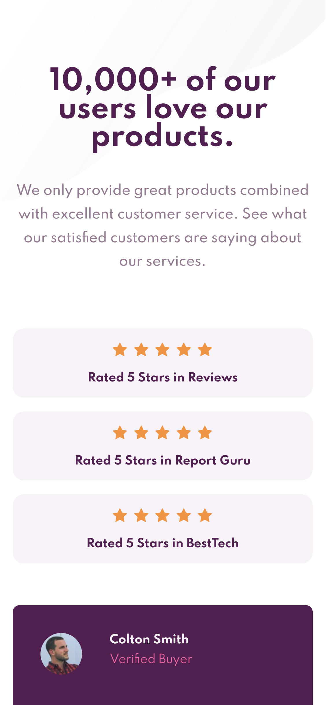

# Frontend Mentor - Social proof section solution

This is a solution to the [Social proof section challenge on Frontend Mentor](https://www.frontendmentor.io/challenges/social-proof-section-6e0qTv_bA). Frontend Mentor challenges help you improve your coding skills by building realistic projects. 

## Table of contents

- [Overview](#overview)
  - [The challenge](#the-challenge)
  - [Screenshot](#screenshot)
  - [Links](#links)
- [My process](#my-process)
  - [Built with](#built-with)
  - [What I learned](#what-i-learned)
  - [Continued development](#continued-development)
  - [Useful resources](#useful-resources)
- [Author](#author)
- [Acknowledgments](#acknowledgments)


## Overview

### The challenge

Users should be able to:

- View the optimal layout for the section depending on their device's screen size

### Screenshot




### Links

- Solution URL: [Add solution URL here](https://your-solution-url.com)
- Live Site URL: [Add live site URL here](https://your-live-site-url.com)

## My process

### Built with

- Semantic HTML5 markup
- CSS custom properties
- Flexbox
- CSS Grid
- Mobile-first workflow

### What I learned

One area that I personally struggle with is accessibility and I learned that there are resources such as ./https://www.a11yproject.com/checklist/#global-code. What helped me overview accessibility guidlines.

To see how you can add code snippets, see below:


###code I'd like to showcase
```scss

:root {
    --clr-primary-700: hsl(300, 43%, 22%);
    --clr-primary-300: hsl(333, 80%, 67%);

    --clr-neutral-500: hsl(303, 10%, 53%);
    --clr-neutral-400: hsl(300, 24%, 96%);
    --clr-neutral-100: hsl(0, 0%, 100%);

    --ff-primary:'spartan', sans-serif;

    
    --fs-base: 0.8125rem;
    --fs-lg: 1rem;
    --fs-xlg: 2rem;

    @media (min-width: 50em) {
        --fs-xlg: 3rem;
    }
  
}

```

### Continued development

I will conitue to work with CSS Grid in firefox instead of Goodle Chrome. Personally, I feel that the dev tools that are available in Firefox are much better when it comes to working with grid. I will also challege myself to begin to work on larger projects.

### Useful resources

- [Example resource 1](https://youtu.be/K27WULzr2P8) - If you don't follow Kevin Powell's YouTube he post awesome tourtorials. I followed his framework mainly for formatting purposes. 

## Author

- Frontend Mentor - [@Qstar12](https://www.frontendmentor.io/profile/Qstar12)
- Twitter - [@AmarioJones1](https://twitter.com/AmarioJones1)

## Acknowledgments

Thanks to those who have supported my work. Thanks to platforms such as Frontendmentor for giving me the opportunity to learn and grow.
